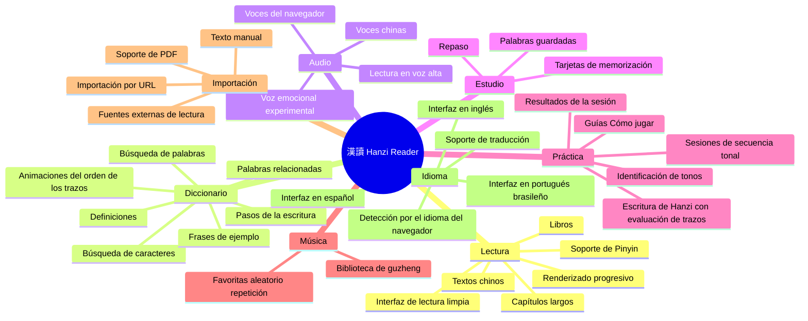
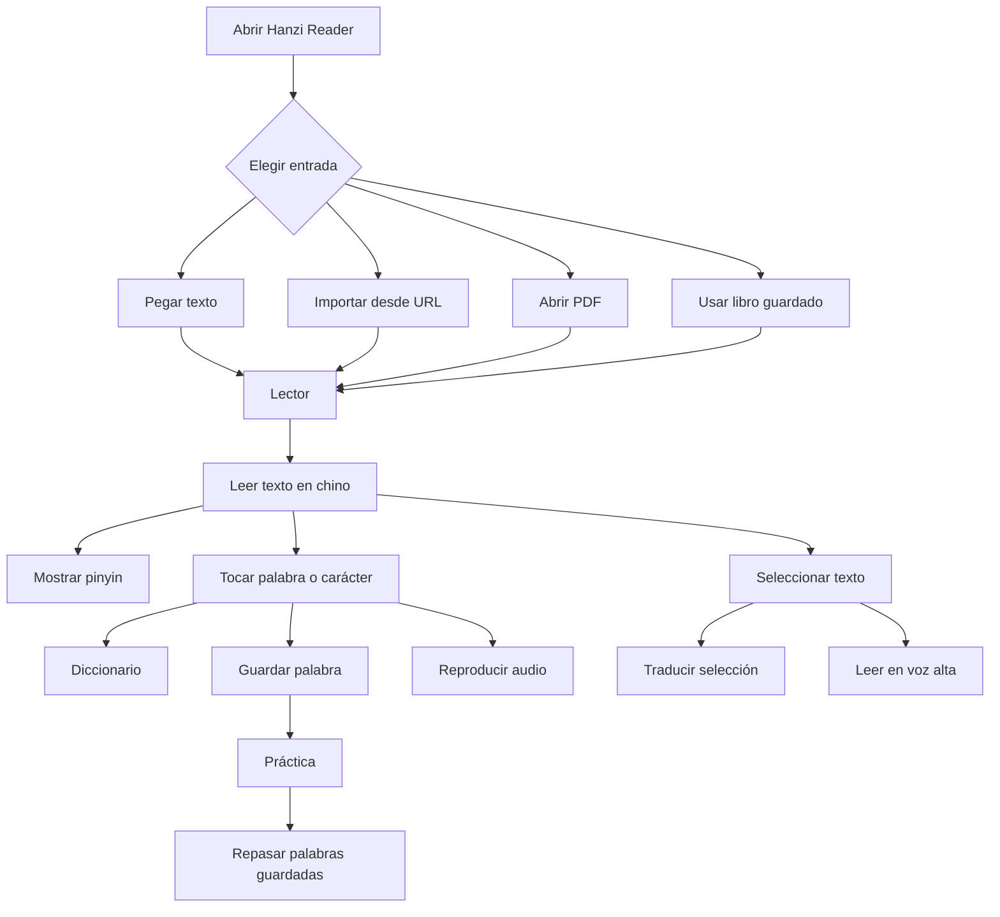
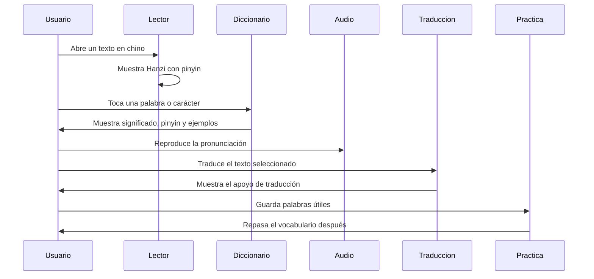
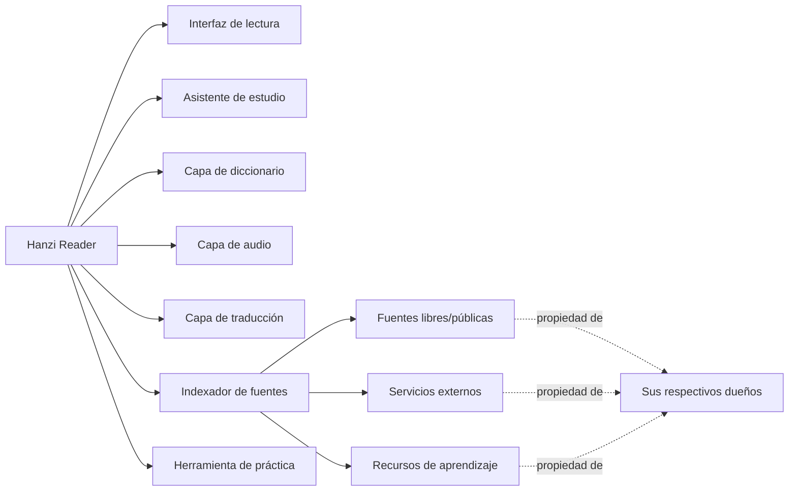
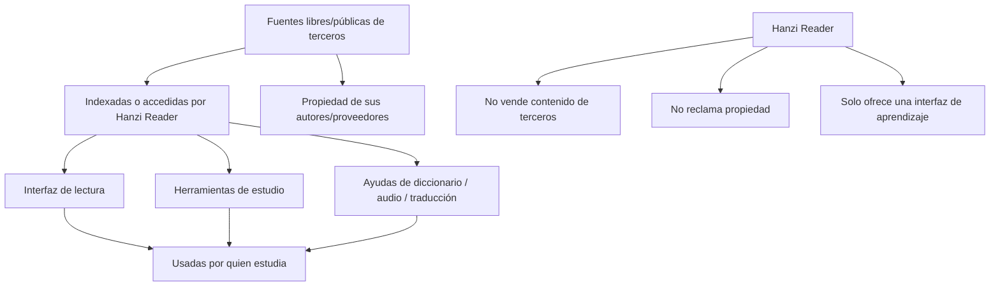
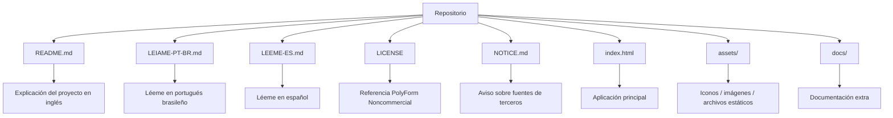

# 漢讀 · Hanzi Reader

> Un lector de Hanzi gratuito y de código disponible para estudiar chino a través de la lectura real.

[🇺🇸 Read in English](./README.md)

[🇧🇷 Ler em Português Brasileiro](./LEIAME-PT-BR.md)

**漢讀 · Hanzi Reader** es una herramienta de lectura en chino hecha para quienes quieren leer textos, libros, historias y materiales de estudio en mandarín con apoyo útil para el aprendizaje — sin tener que pagar una suscripción mensual por funciones básicas de lectura.

Este proyecto nació porque creo que herramientas simples para leer tus propios libros, añadir pinyin, consultar palabras, escuchar la pronunciación y estudiar chino deberían ser accesibles.

---

## Estado

```text
Tipo de proyecto: Código disponible (source-available)
Propósito principal: Lectura y estudio de chino
Reventa comercial: No permitida
Licencia: PolyForm Noncommercial License 1.0.0
Autor: Sr. Hell
```

---

## Por qué lo hice

Me frustraban las aplicaciones que bloquean funciones de lectura muy básicas detrás de suscripciones.

Pagar cada mes solo para leer mis propios libros, ver pinyin, consultar palabras o escuchar una pronunciación simple no me parecía justo.

Así que empecé a construir mi propio lector — simple, directo y centrado en ayudar a quienes estudian chino.

Hanzi Reader es mi intento de crear una herramienta práctica, gratuita y accesible para estudiar chino a través de la lectura real.

---

## Qué hace Hanzi Reader



---

## Funciones principales

- Lectura de textos en chino con soporte de pinyin
- Importación de texto manual o por URL
- Lectura de libros, capítulos y textos largos en una interfaz limpia
- Lector progresivo: el fragmento inicial aparece al instante y los textos largos cargan en segundo plano
- Guardado de palabras durante la lectura
- Diccionario integrado
- Definiciones de palabras y soporte de traducción automática
- Animaciones del orden de los trazos con el botón "Pasos" mostrando cada etapa de la escritura
- Texto a voz / lectura en voz alta
- Opciones de voces chinas
- Modos experimentales de voz emocional
- Área de práctica con identificación de tonos, secuencia tonal y Escritura de Hanzi
- Evaluación de la escritura: similitud estimada por orden, dirección, forma, posición y proporción de los trazos
- Pantallas "Cómo jugar" en el primer acceso a cada actividad
- Pantallas de práctica concluida con resumen de la sesión y una breve pista de cierre
- Biblioteca de música de guzheng con favoritas, aleatorio y repetición
- Tarjetas de memorización y repaso del contenido guardado
- Interfaz en portugués brasileño, inglés y español
- Idioma automático según el idioma del navegador
- Almacenamiento local de los datos en el navegador (preferencias ligeras en localStorage; sesiones y cachés en IndexedDB, con respaldo automático)
- Soporte de lectura de PDF
- Indexación / integración de fuentes externas con fines de estudio

---

## Novedades de la v5.1

- **Los Pasos vuelven al Diccionario**: debajo de la animación del orden de los trazos, el botón **Pasos** expande las imágenes estáticas de cada etapa de la escritura — y se contrae con un segundo toque.
- **Escritura de Hanzi reconstruida**: busca el ideograma que quieres entrenar, mantén el GIF del orden de los trazos y sus pasos junto al cuadrado de práctica y concluye cada carácter para recibir una **similitud estimada** (orden 25%, dirección 20%, forma 20%, posición 20%, proporción 15%), reutilizando el mismo análisis de trazos del reconocedor manual.
- **Secuencia tonal sin límite fijo**: juega cuantos desafíos quieras; el encabezado muestra desafíos, racha actual, aciertos y precisión parcial. Al terminar (botón, flecha, Volver del dispositivo o Esc), se abre la pantalla de resultados compartida con desafíos, aciertos, errores, precisión, mayor racha, tonos con más errores, tiempo y puntuación — además de la breve pista de cierre.
- **Cierre fiable en toda práctica**: el botón Volver del dispositivo y Esc ahora cierran las actividades pasando por la pantalla de resultados, en lugar de salir de la app.
- **Pantallas "Cómo jugar"** para el trazado de tonos y la Escritura de Hanzi aparecen en el primer acceso (con una representación visual de los cuatro tonos y del tono neutro por toque) y siguen disponibles en el botón "?".
- **Apertura más rápida de Lecturas Simples y Libros**: el primer fragmento se renderiza de inmediato, la interfaz sigue respondiendo y el resto entra por lotes en segundo plano — pausando al salir de la pantalla y retomando al volver.
- **Definiciones de caracteres simples corregidas**: el resolvedor del diccionario normaliza la entrada, prueba variantes simplificada/tradicional y fuentes extra, y nunca guarda un fallo temporal de red como "no encontrado".
- **Capa unificada de almacenamiento**: preferencias pequeñas en localStorage (con caché en memoria), sesiones y caché de diccionario en IndexedDB, migración segura por lotes y respaldo en memoria cuando IndexedDB no está disponible.
- **Interfaz en español** añadida, con un nuevo selector de idioma en acordeón en los Ajustes (funciona con toque, ratón y teclado).
- **Iconos del pie refinados** (Práctica como un guzheng minimalista con ondas sonoras; Flash Cards como tarjetas apiladas) y el **modal de Música ya no abre el teclado automáticamente** — el campo de búsqueda solo recibe el foco cuando lo tocas.

---

## Flujo de la aplicación



---

## Flujo de estudio



---

## Filosofía del proyecto

Este proyecto está pensado para seguir siendo simple, útil y accesible.

Puedes usarlo, estudiarlo, modificarlo y mejorarlo con fines personales, educativos y no comerciales.

Por favor, no tomes este proyecto para revenderlo como un clon de pago.

El objetivo es ayudar a quienes aprenden, no crear otro muro de pago.

---

## Qué es este proyecto



---

## Qué NO es este proyecto

Hanzi Reader **no** es un clon de pago.

Hanzi Reader **no** es un producto comercial.

Hanzi Reader **no** reclama la propiedad de fuentes, voces, APIs, conjuntos de datos, sitios web o materiales de aprendizaje de terceros.

Hanzi Reader solo ofrece un lector, una interfaz, una capa de estudio, una capa de traducción, un índice y una capa de integración con fines de aprendizaje.

---

## Fuentes y contenido de terceros

Este proyecto puede indexar, conectarse, referenciar o integrar recursos libres/públicos de terceros y servicios accesibles desde el navegador, incluyendo:

- Voces de texto a voz del navegador / Microsoft Edge
- Servicios de traducción
- Fuentes de aprendizaje de chino
- Herramientas de pinyin
- Datos de diccionario
- Recursos de orden de trazos
- Herramientas de lectura de PDF
- Fuentes de lectura públicas o gratuitas

No reclamo la propiedad de fuentes, servicios, voces, conjuntos de datos, APIs, sitios web, bibliotecas o contenido externo usado, referenciado, indexado o integrado por la aplicación.

Todos los recursos de terceros siguen siendo propiedad de sus respectivos dueños y están sujetos a sus propias licencias, términos de uso, límites, disponibilidad y restricciones.

---

## Relación con las fuentes



---

## Estructura del repositorio



Estructura recomendada:

```text
hanzi-reader/
├── README.md
├── LEIAME-PT-BR.md
├── LEEME-ES.md
├── LICENSE
├── NOTICE.md
├── index.html
├── assets/
└── docs/
```

---

## Licencia

Este proyecto se publica bajo la **PolyForm Noncommercial License 1.0.0**.

Puedes usar, estudiar, modificar y compartir este proyecto para:

- Uso personal
- Uso educativo
- Investigación
- Aprendizaje
- Modificación no comercial
- Redistribución no comercial con atribución

**No** puedes:

- Vender este proyecto
- Revender versiones modificadas
- Revender versiones sin modificar
- Incluirlo en productos de pago
- Ofrecerlo como servicio alojado de pago
- Ponerlo detrás de una suscripción
- Usarlo comercialmente sin permiso explícito y por escrito del autor

Este proyecto tiene el **código disponible**, pero **no está licenciado para reventa comercial**.

Consulta [LICENSE](./LICENSE) y [NOTICE.md](./NOTICE.md) para más detalles.

---

## AVISO

Lee también el archivo [NOTICE.md](./NOTICE.md).

Ese archivo explica que Hanzi Reader puede indexar, conectarse o integrar recursos libres/públicos de terceros, pero no reclama su propiedad.

Las fuentes de terceros siguen siendo de sus respectivos dueños.

---

## Descargo de responsabilidad

Este es un proyecto personal de aprendizaje y puede contener errores, limitaciones o funciones experimentales.

Algunos servicios usados por la aplicación pueden depender del soporte del navegador, del acceso a la red o de la disponibilidad de terceros.

Si algo deja de funcionar, puede deberse a cambios en servicios externos.

---

## Contribuir

Sugerencias, mejoras y reportes de errores son bienvenidos.

Si encuentras un problema, tienes una idea o quieres mejorar el proyecto, abre un issue o contáctame.

Por favor, mantén el proyecto no comercial y accesible.

---

## Autor

Hecho por **Sr. Hell**.

Gratuito para uso personal, educativo y no comercial.

Por favor, no vendas este proyecto.
