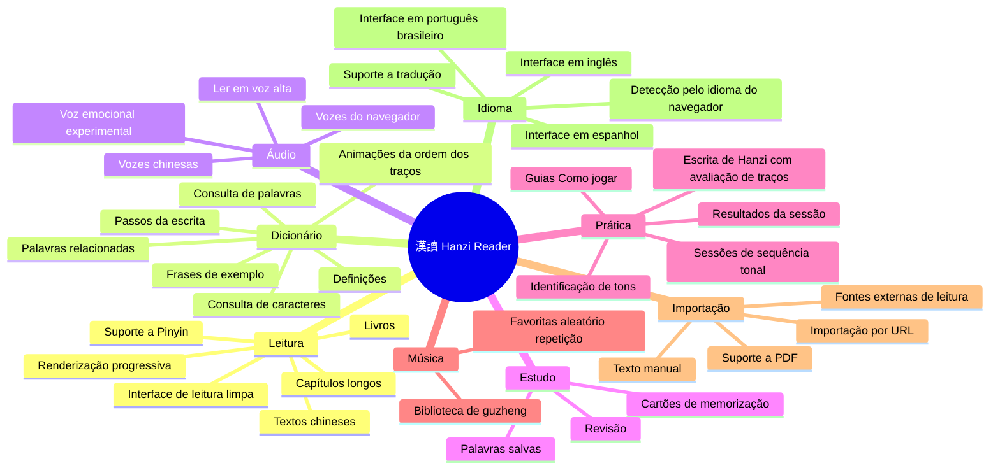
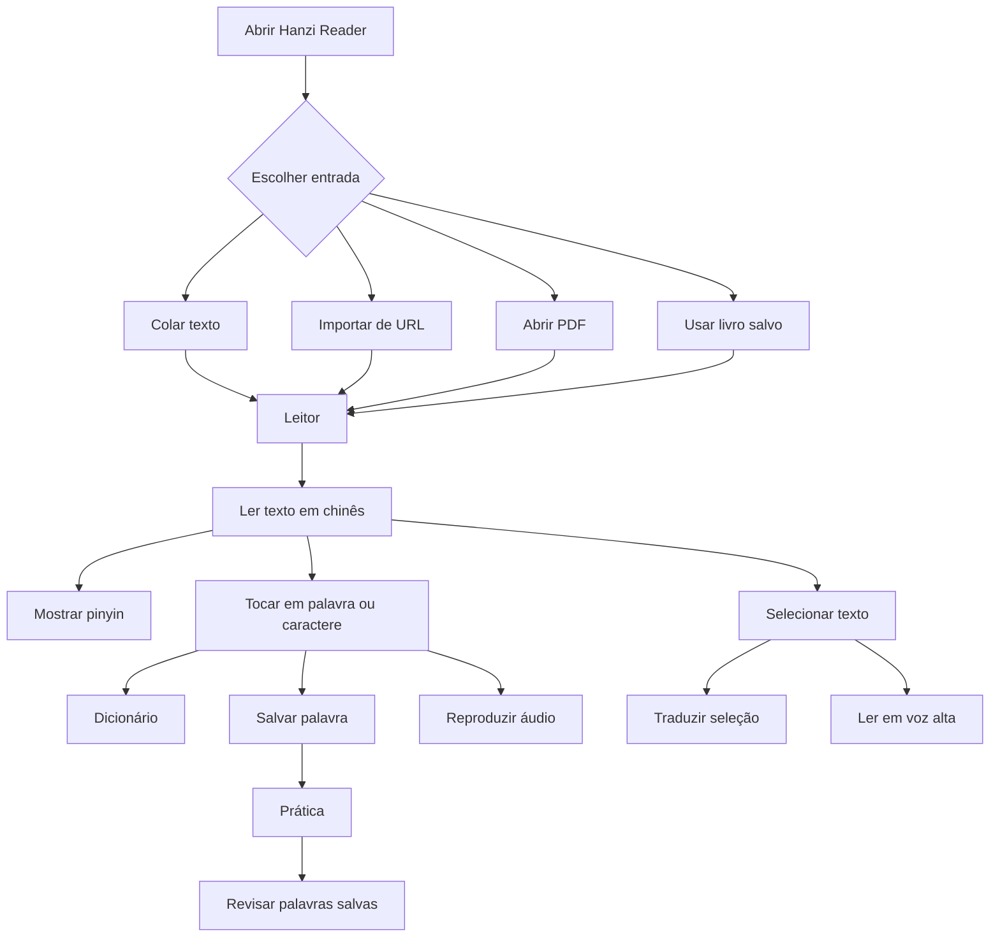
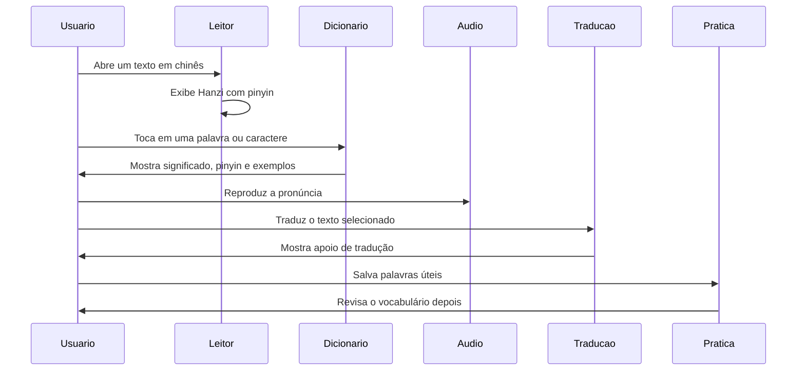
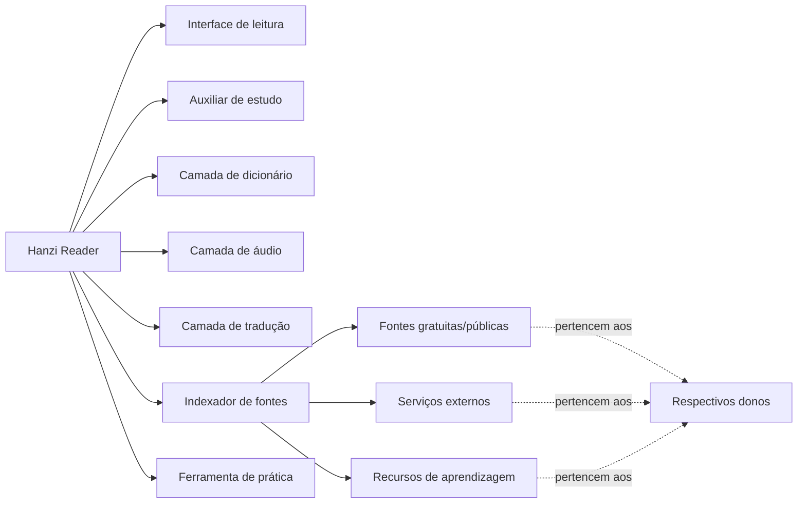
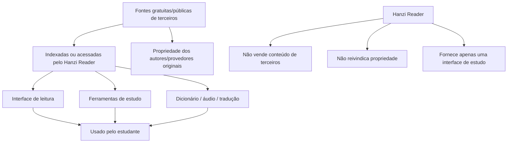
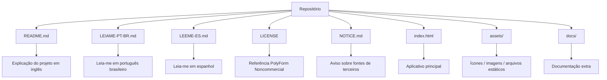

# 漢讀 · Hanzi Reader

> Leitor de Hanzi gratuito e com código-fonte disponível para estudar chinês através de leitura real.

[🇺🇸 Read in English](./README.md)

[🇪🇸 Leer en Español](./LEEME-ES.md)

**漢讀 · Hanzi Reader** é uma ferramenta de leitura para pessoas que querem ler textos, livros, histórias e materiais em mandarim com suporte útil para estudo — sem precisar pagar assinatura mensal por funções básicas.

Este projeto foi criado porque acredito que ferramentas simples para ler seus próprios livros, adicionar pinyin, consultar palavras, ouvir pronúncia e estudar chinês deveriam ser acessíveis.

---

## Status

```text
Tipo do projeto: Código-fonte disponível
Objetivo principal: Leitura e estudo de chinês
Revenda comercial: Não permitida
Licença: PolyForm Noncommercial License 1.0.0
Autor: Sr. Hell
```

---

## Por que eu criei este projeto

Eu fiquei frustrado com aplicativos que bloqueiam funções básicas de leitura atrás de assinaturas.

Pagar mensalmente apenas para ler meus próprios livros, ver pinyin, consultar palavras ou ouvir uma pronúncia simples não fazia sentido para mim.

Então comecei a criar meu próprio leitor — simples, direto e focado em ajudar estudantes de chinês.

Hanzi Reader é minha tentativa de criar uma ferramenta prática, gratuita e acessível para estudar chinês através de leitura real.

---

## O que o Hanzi Reader faz



---

## Principais recursos

- Leitura de textos em chinês com suporte a pinyin
- Importação de texto manualmente ou por URL
- Leitura de livros, capítulos e textos longos em uma interface limpa
- Leitor progressivo: o trecho inicial aparece na hora e textos longos carregam em segundo plano
- Salvamento de palavras durante a leitura
- Dicionário integrado
- Definições de palavras e suporte a tradução automática
- Animações da ordem dos traços com o botão "Passos" mostrando cada etapa da escrita
- Texto para fala / leitura em voz alta
- Opções de vozes chinesas
- Modos experimentais de voz emocional
- Área de prática com identificação de tons, sequência tonal e Escrita de Hanzi
- Avaliação da escrita: similaridade estimada por ordem, direção, forma, posição e proporção dos traços
- Telas "Como jogar" no primeiro acesso a cada atividade
- Telas de prática concluída com resumo da sessão e trilha curta de encerramento
- Biblioteca de músicas de guzheng com favoritas, aleatório e repetição
- Cartões de memorização e revisão do conteúdo salvo
- Suporte de interface em português brasileiro, inglês e espanhol
- Idioma automático baseado no idioma do navegador
- Armazenamento local dos dados no navegador (preferências leves no localStorage; sessões e caches no IndexedDB, com fallback automático)
- Suporte à leitura de PDF
- Indexação / integração de fontes externas para fins de estudo

---

## Novidades da v5.1

- **Passos de volta ao Dicionário**: abaixo da animação da ordem dos traços, o botão **Passos** expande as imagens estáticas de cada etapa da escrita — e recolhe no segundo toque.
- **Escrita de Hanzi reconstruída**: pesquise o ideograma que quer treinar, mantenha o GIF da ordem dos traços e seus passos ao lado do quadrado de prática e conclua cada caractere para receber uma **similaridade estimada** (ordem 25%, direção 20%, forma 20%, posição 20%, proporção 15%), reutilizando a mesma análise de traços do reconhecedor manual.
- **Sequência tonal sem limite fixo**: jogue quantos desafios quiser; o cabeçalho mostra desafios, sequência atual, acertos e precisão parcial. Ao encerrar (botão, seta, Voltar do dispositivo ou Esc), abre a tela de resultados compartilhada com desafios, acertos, erros, precisão, maior sequência, tons com mais erros, tempo e pontuação — além da trilha curta de encerramento.
- **Encerramento confiável em toda prática**: o Voltar do dispositivo e o Esc agora fecham as atividades passando pela tela de resultados, em vez de sair do app.
- **Telas "Como jogar"** para o desenho de tons e para a Escrita de Hanzi aparecem no primeiro acesso (com representação visual dos quatro tons e do tom neutro por toque) e continuam disponíveis no botão "?".
- **Abertura mais rápida de Leituras Simples e Livros**: o primeiro trecho renderiza imediatamente, a interface segue responsiva e o restante entra em lotes em segundo plano — pausando ao sair da tela e retomando ao voltar.
- **Definições de caracteres simples corrigidas**: o resolvedor do dicionário normaliza a entrada, testa variantes simplificada/tradicional e fontes extras, e nunca grava uma falha temporária de rede como "não encontrado".
- **Camada unificada de armazenamento**: preferências pequenas no localStorage (com cache em memória), sessões e cache de dicionário no IndexedDB, migração segura em lotes e fallback de memória quando o IndexedDB não está disponível.
- **Interface em espanhol** adicionada, com novo seletor de idioma em sanfona nas Configurações (funciona com toque, mouse e teclado).
- **Ícones do rodapé refinados** (Prática como um guzheng minimalista com ondas sonoras; Flash Cards como cartões empilhados) e o **modal de Música não abre mais o teclado automaticamente** — o campo de busca só recebe foco quando você toca nele.

---

## Fluxo do aplicativo



---

## Fluxo de estudo



---

## Filosofia do projeto

Este projeto foi feito para permanecer simples, útil e acessível.

Você pode usar, estudar, modificar e melhorar este projeto para fins pessoais, educacionais e não comerciais.

Por favor, não pegue este projeto e revenda como um clone pago.

O objetivo é ajudar estudantes, não criar mais uma barreira paga.

---

## O que este projeto é



---

## O que este projeto não é

Hanzi Reader **não** é um clone pago.

Hanzi Reader **não** é um produto comercial.

Hanzi Reader **não** reivindica propriedade sobre fontes, vozes, APIs, bancos de dados, sites ou materiais de estudo de terceiros.

Hanzi Reader fornece apenas um leitor, interface, camada de estudo, camada de tradução, indexação e integração para fins de aprendizagem.

---

## Fontes e conteúdo de terceiros

Este projeto pode indexar, conectar, referenciar ou integrar recursos gratuitos/públicos de terceiros e serviços acessíveis pelo navegador, incluindo:

- Vozes do navegador / Microsoft Edge
- Serviços de tradução
- Fontes de estudo de chinês
- Ferramentas de pinyin
- Dados de dicionário
- Recursos de ordem de traços
- Ferramentas de leitura de PDF
- Fontes públicas ou gratuitas de leitura

Eu não reivindico propriedade sobre fontes, serviços, vozes, bancos de dados, APIs, sites, bibliotecas ou conteúdos externos usados, referenciados, indexados ou integrados pelo aplicativo.

Todos os recursos de terceiros permanecem propriedade de seus respectivos donos e estão sujeitos às suas próprias licenças, termos de uso, limites de uso, disponibilidade e restrições.

---

## Relação com as fontes



---

## Estrutura do repositório



Estrutura recomendada:

```text
hanzi-reader/
├── README.md
├── LEIAME-PT-BR.md
├── LEEME-ES.md
├── LICENSE
├── NOTICE.md
├── index.html
├── assets/
└── docs/
```

---

## Licença

Este projeto é disponibilizado sob a **PolyForm Noncommercial License 1.0.0**.

Você pode usar, estudar, modificar e compartilhar este projeto para:

- Uso pessoal
- Uso educacional
- Pesquisa
- Aprendizado
- Modificação não comercial
- Redistribuição não comercial com atribuição

Você **não pode**:

- Vender este projeto
- Revender versões modificadas
- Revender versões não modificadas
- Incluir este projeto em produtos pagos
- Oferecer este projeto como serviço hospedado pago
- Colocar este projeto atrás de uma assinatura
- Usar este projeto comercialmente sem permissão explícita por escrito do autor

Este projeto possui **código-fonte disponível**, mas **não está licenciado para revenda comercial**.

Veja [LICENSE](./LICENSE) e [NOTICE.md](./NOTICE.md) para mais detalhes.

---

## NOTICE

Leia também o arquivo [NOTICE.md](./NOTICE.md).

Esse arquivo explica que Hanzi Reader pode indexar, conectar ou integrar recursos gratuitos/públicos de terceiros, mas não reivindica propriedade sobre eles.

As fontes de terceiros permanecem propriedade de seus respectivos donos.

---

## Aviso

Este é um projeto pessoal de aprendizado e pode conter bugs, limitações ou recursos experimentais.

Alguns serviços usados pelo aplicativo podem depender do suporte do navegador, acesso à rede ou disponibilidade de terceiros.

Se algo parar de funcionar, pode ter sido causado por mudanças em serviços externos.

---

## Contribuição

Sugestões, melhorias e relatos de bugs são bem-vindos.

Se você encontrar um problema, tiver uma ideia ou quiser melhorar o projeto, fique à vontade para abrir uma issue ou entrar em contato.

Por favor, mantenha o projeto não comercial e acessível.

---

## Autor

Feito por **Sr. Hell**.

Gratuito para uso pessoal, educacional e não comercial.

Por favor, não venda este projeto.
