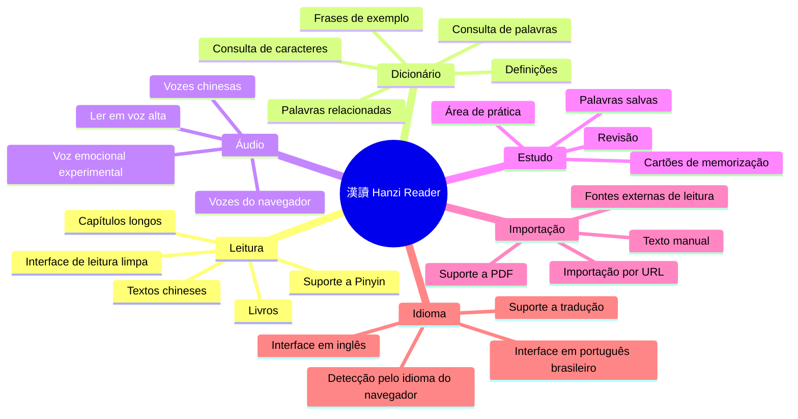
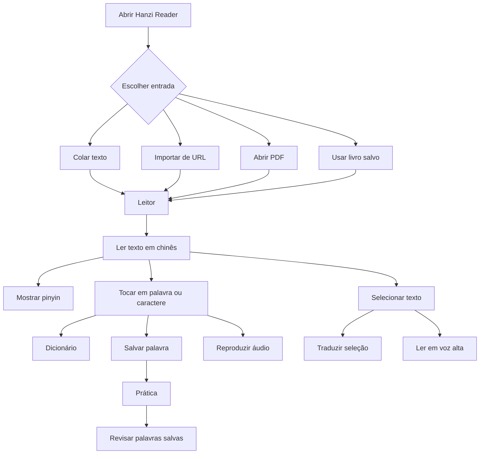
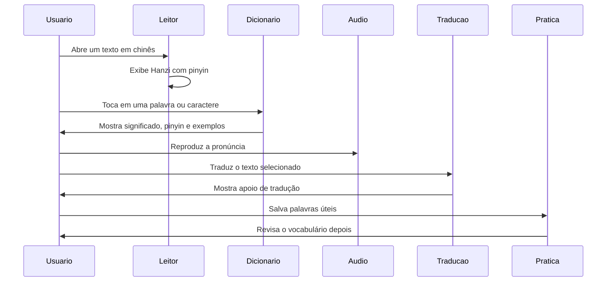
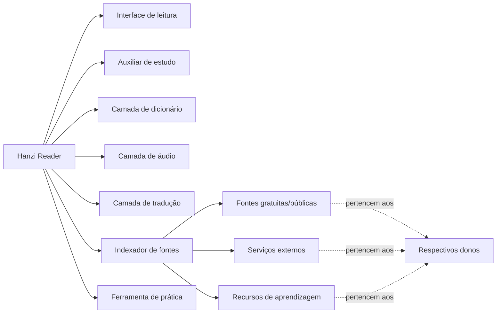
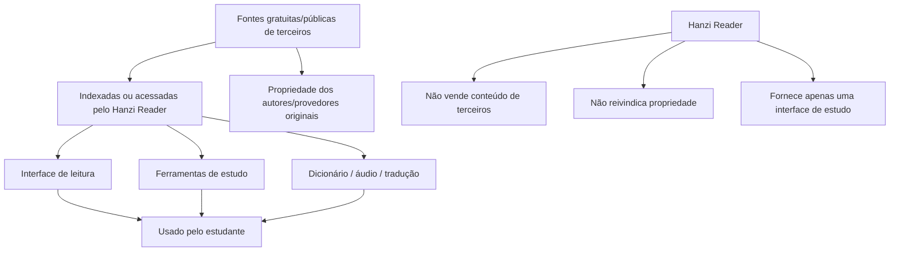
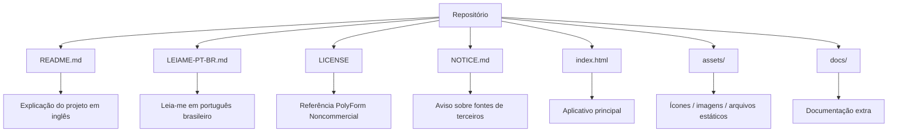

# 漢讀 · Hanzi Reader

> Leitor de Hanzi gratuito e com código-fonte disponível para estudar chinês através de leitura real.

[🇺🇸 Read in English](./README.md)

**漢讀 · Hanzi Reader** é uma ferramenta de leitura para pessoas que querem ler textos, livros, histórias e materiais em mandarim com suporte útil para estudo — sem precisar pagar assinatura mensal por funções básicas.

Este projeto foi criado porque acredito que ferramentas simples para ler seus próprios livros, adicionar pinyin, consultar palavras, ouvir pronúncia e estudar chinês deveriam ser acessíveis.

---

## Status

```text
Tipo do projeto: Código-fonte disponível
Objetivo principal: Leitura e estudo de chinês
Revenda comercial: Não permitida
Licença: PolyForm Noncommercial License 1.0.0
Autor: Sr. Hell
```

---

## Por que eu criei este projeto

Eu fiquei frustrado com aplicativos que bloqueiam funções básicas de leitura atrás de assinaturas.

Pagar mensalmente apenas para ler meus próprios livros, ver pinyin, consultar palavras ou ouvir uma pronúncia simples não fazia sentido para mim.

Então comecei a criar meu próprio leitor — simples, direto e focado em ajudar estudantes de chinês.

Hanzi Reader é minha tentativa de criar uma ferramenta prática, gratuita e acessível para estudar chinês através de leitura real.

---

## O que o Hanzi Reader faz



---

## Principais recursos

- Leitura de textos em chinês com suporte a pinyin
- Importação de texto manualmente ou por URL
- Leitura de livros, capítulos e textos longos em uma interface limpa
- Salvamento de palavras durante a leitura
- Dicionário integrado
- Definições de palavras e suporte a tradução automática
- Texto para fala / leitura em voz alta
- Opções de vozes chinesas
- Modos experimentais de voz emocional
- Área de prática para revisar conteúdo salvo
- Suporte de interface em português brasileiro e inglês
- Idioma automático baseado no idioma do navegador
- Armazenamento local dos dados no navegador
- Suporte à leitura de PDF
- Indexação / integração de fontes externas para fins de estudo

---

## Fluxo do aplicativo



---

## Fluxo de estudo



---

## Filosofia do projeto

Este projeto foi feito para permanecer simples, útil e acessível.

Você pode usar, estudar, modificar e melhorar este projeto para fins pessoais, educacionais e não comerciais.

Por favor, não pegue este projeto e revenda como um clone pago.

O objetivo é ajudar estudantes, não criar mais uma barreira paga.

---

## O que este projeto é



---

## O que este projeto não é

Hanzi Reader **não** é um clone pago.

Hanzi Reader **não** é um produto comercial.

Hanzi Reader **não** reivindica propriedade sobre fontes, vozes, APIs, bancos de dados, sites ou materiais de estudo de terceiros.

Hanzi Reader fornece apenas um leitor, interface, camada de estudo, camada de tradução, indexação e integração para fins de aprendizagem.

---

## Fontes e conteúdo de terceiros

Este projeto pode indexar, conectar, referenciar ou integrar recursos gratuitos/públicos de terceiros e serviços acessíveis pelo navegador, incluindo:

- Vozes do navegador / Microsoft Edge
- Serviços de tradução
- Fontes de estudo de chinês
- Ferramentas de pinyin
- Dados de dicionário
- Recursos de ordem de traços
- Ferramentas de leitura de PDF
- Fontes públicas ou gratuitas de leitura

Eu não reivindico propriedade sobre fontes, serviços, vozes, bancos de dados, APIs, sites, bibliotecas ou conteúdos externos usados, referenciados, indexados ou integrados pelo aplicativo.

Todos os recursos de terceiros permanecem propriedade de seus respectivos donos e estão sujeitos às suas próprias licenças, termos de uso, limites de uso, disponibilidade e restrições.

---

## Relação com as fontes



---

## Estrutura do repositório



Estrutura recomendada:

```text
hanzi-reader/
├── README.md
├── LEIAME-PT-BR.md
├── LICENSE
├── NOTICE.md
├── index.html
├── assets/
└── docs/
```

---

## Licença

Este projeto é disponibilizado sob a **PolyForm Noncommercial License 1.0.0**.

Você pode usar, estudar, modificar e compartilhar este projeto para:

- Uso pessoal
- Uso educacional
- Pesquisa
- Aprendizado
- Modificação não comercial
- Redistribuição não comercial com atribuição

Você **não pode**:

- Vender este projeto
- Revender versões modificadas
- Revender versões não modificadas
- Incluir este projeto em produtos pagos
- Oferecer este projeto como serviço hospedado pago
- Colocar este projeto atrás de uma assinatura
- Usar este projeto comercialmente sem permissão explícita por escrito do autor

Este projeto possui **código-fonte disponível**, mas **não está licenciado para revenda comercial**.

Veja [LICENSE](./LICENSE) e [NOTICE.md](./NOTICE.md) para mais detalhes.

---

## NOTICE

Leia também o arquivo [NOTICE.md](./NOTICE.md).

Esse arquivo explica que Hanzi Reader pode indexar, conectar ou integrar recursos gratuitos/públicos de terceiros, mas não reivindica propriedade sobre eles.

As fontes de terceiros permanecem propriedade de seus respectivos donos.

---

## Aviso

Este é um projeto pessoal de aprendizado e pode conter bugs, limitações ou recursos experimentais.

Alguns serviços usados pelo aplicativo podem depender do suporte do navegador, acesso à rede ou disponibilidade de terceiros.

Se algo parar de funcionar, pode ter sido causado por mudanças em serviços externos.

---

## Contribuição

Sugestões, melhorias e relatos de bugs são bem-vindos.

Se você encontrar um problema, tiver uma ideia ou quiser melhorar o projeto, fique à vontade para abrir uma issue ou entrar em contato.

Por favor, mantenha o projeto não comercial e acessível.

---

## Autor

Feito por **Sr. Hell**.

Gratuito para uso pessoal, educacional e não comercial.

Por favor, não venda este projeto.
