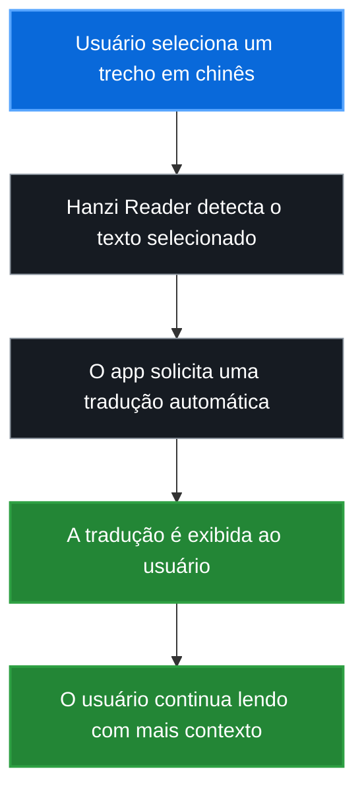
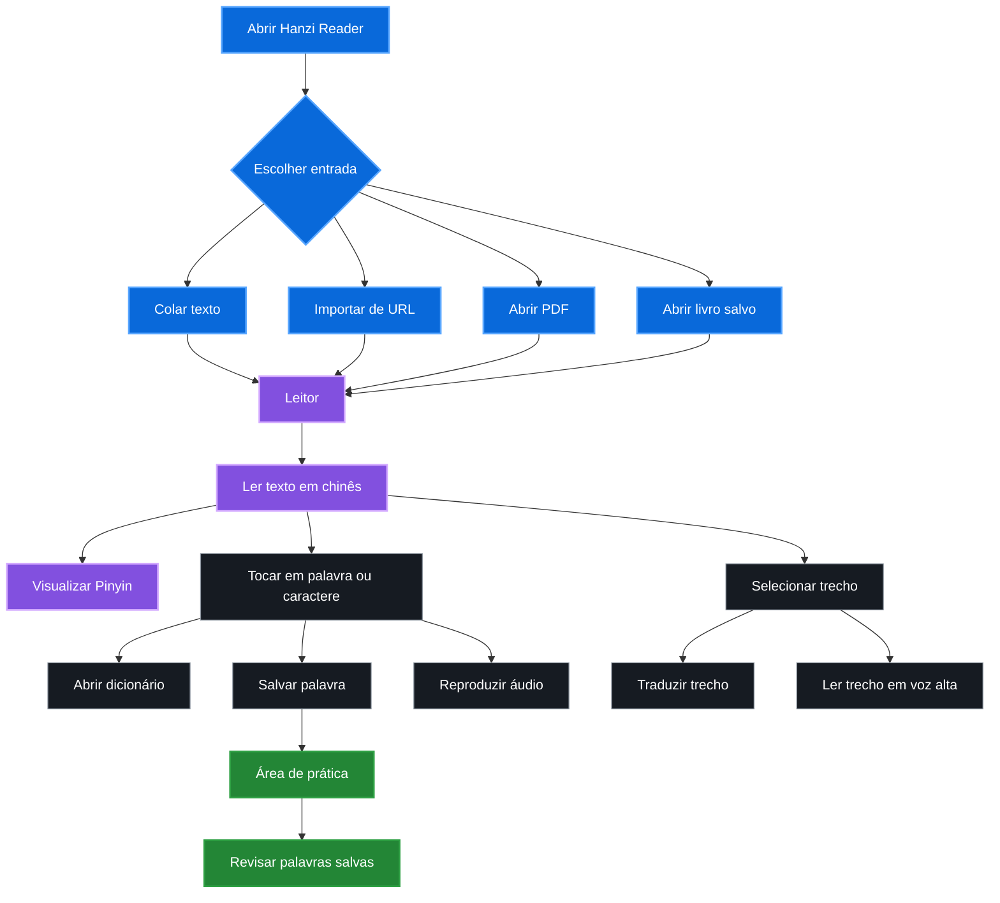
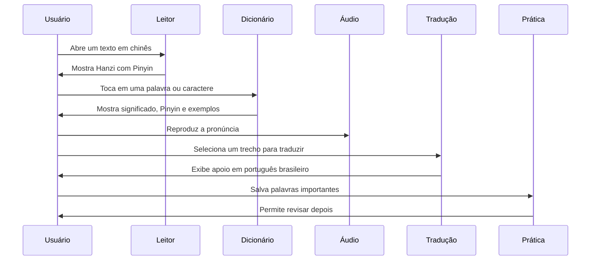
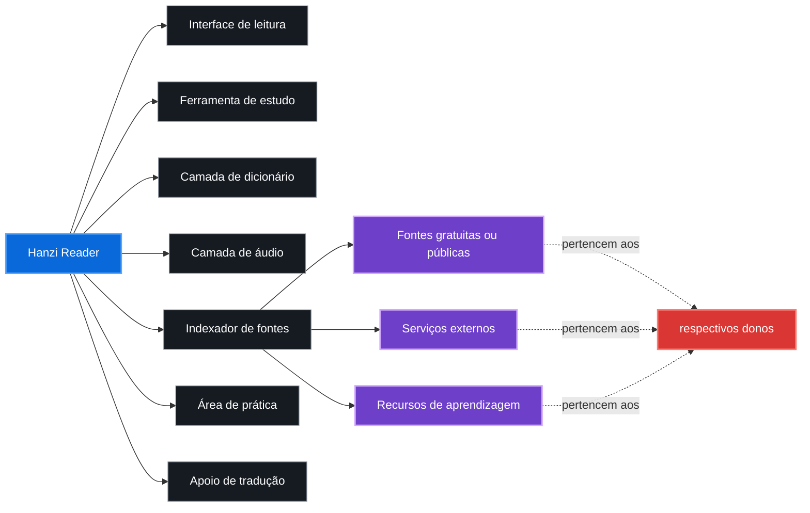
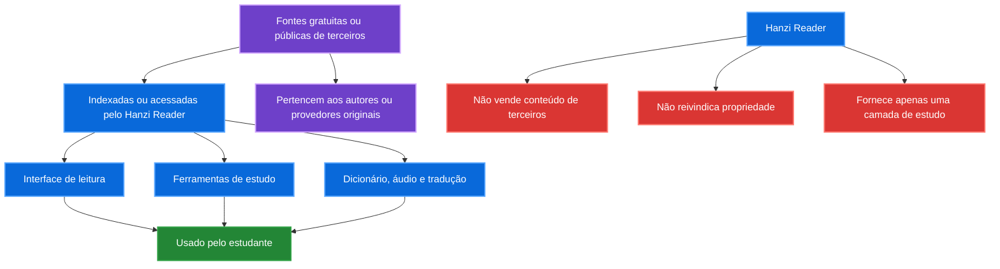
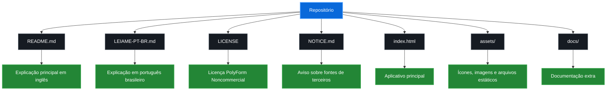

# 漢讀 · Hanzi Reader

> Leitor de Hanzi gratuito e com código-fonte disponível para estudar chinês através de leitura real.

[🇺🇸 Read in English](./README.md)

---

## Sobre

**漢讀 · Hanzi Reader** é uma ferramenta de leitura para estudantes de chinês que querem ler textos, livros, histórias e materiais em mandarim com suporte de estudo — sem precisar pagar assinatura mensal por funções básicas.

O projeto foi criado porque acredito que ferramentas simples para ler seus próprios textos, visualizar Pinyin, consultar palavras, ouvir pronúncia, traduzir trechos e estudar chinês deveriam ser acessíveis.

---

## Status do projeto

```text
Tipo do projeto: Código-fonte disponível
Objetivo principal: Leitura e estudo de chinês
Revenda comercial: Não permitida
Licença: PolyForm Noncommercial License 1.0.0
Autor: Sr. Hell
```

---

## Por que eu criei este projeto

Eu fiquei frustrado com aplicativos que bloqueiam funções básicas de leitura atrás de assinaturas.

Pagar mensalmente apenas para ler meus próprios livros, ver Pinyin, consultar palavras, ouvir uma pronúncia simples ou traduzir trechos não fazia sentido para mim.

Então comecei a criar meu próprio leitor: simples, direto e focado em ajudar estudantes de chinês.

O **Hanzi Reader** é uma tentativa de criar uma ferramenta prática, gratuita e acessível para estudar chinês através de leitura real.

---

## O que o Hanzi Reader faz

```mermaid
flowchart TD
    A["漢讀 · Hanzi Reader"]

    A --> B["Leitura"]
    B --> B1["Textos chineses"]
    B --> B2["Livros"]
    B --> B3["Capítulos longos"]
    B --> B4["Interface limpa de leitura"]
    B --> B5["Suporte a Pinyin"]

    A --> C["Dicionário"]
    C --> C1["Consulta de palavras"]
    C --> C2["Consulta de caracteres"]
    C --> C3["Definições"]
    C --> C4["Palavras relacionadas"]
    C --> C5["Frases de exemplo"]

    A --> D["Áudio"]
    D --> D1["Ler em voz alta"]
    D --> D2["Vozes chinesas"]
    D --> D3["Vozes do navegador"]
    D --> D4["Voz emocional experimental"]

    A --> E["Estudo"]
    E --> E1["Palavras salvas"]
    E --> E2["Área de prática"]
    E --> E3["Cartões de memorização"]
    E --> E4["Revisão"]

    A --> F["Importação"]
    F --> F1["Texto manual"]
    F --> F2["Importação por URL"]
    F --> F3["Suporte a PDF"]
    F --> F4["Fontes externas de leitura"]

    A --> G["Idioma e tradução"]
    G --> G1["Interface em português brasileiro"]
    G --> G2["Interface em inglês"]
    G --> G3["Detecção pelo idioma do navegador"]
    G --> G4["Tradução automática"]
```



---

## Principais recursos

- Leitura de textos em chinês com suporte a Pinyin.
- Importação de textos manuais.
- Importação de textos por URL.
- Suporte a leitura de PDF.
- Biblioteca local para textos, livros e capítulos.
- Interface limpa para leitura longa.
- Salvamento de palavras durante a leitura.
- Dicionário integrado.
- Consulta de palavras e caracteres chineses.
- Definições, exemplos e palavras relacionadas.
- Tradução automática de definições e trechos.
- Botão para traduzir texto selecionado.
- Leitura em voz alta.
- Suporte a vozes chinesas.
- Suporte a vozes do navegador.
- Voz emocional experimental.
- Área de prática para revisar conteúdo salvo.
- Cartões de memorização.
- Interface em português brasileiro e inglês.
- Idioma automático baseado no idioma do navegador.
- Armazenamento local dos dados no navegador.

---

## Tradução para português brasileiro

O Hanzi Reader possui suporte para tradução automática de palavras, definições e trechos selecionados.

A ideia é ajudar estudantes que estão lendo chinês, mas ainda precisam de apoio em português brasileiro para compreender melhor o conteúdo.



A tradução funciona como apoio de estudo. Ela pode conter erros, limitações ou diferenças de sentido dependendo do contexto da frase.

---

## Fluxo de uso do app



---

## Fluxo de estudo


---

## Jornada do usuário



---

## Filosofia do projeto

Este projeto foi feito para ser simples, útil e acessível.

Você pode usar, estudar, modificar e compartilhar este projeto para fins pessoais, educacionais e não comerciais.

Por favor, não pegue este projeto para revender como um clone pago.

O objetivo é ajudar estudantes, não criar mais uma barreira paga para quem está tentando aprender chinês.

---

## O que este projeto é



---

## O que este projeto não é

O Hanzi Reader **não** é um clone pago.

O Hanzi Reader **não** é um produto comercial.

O Hanzi Reader **não** reivindica propriedade sobre fontes, vozes, APIs, bancos de dados, sites, bibliotecas ou materiais externos de terceiros.

O Hanzi Reader apenas fornece uma interface, leitor, camada de estudo, camada de tradução, indexação e integração para fins educacionais.

---

## Fontes e conteúdo de terceiros

Este projeto pode indexar, conectar, referenciar ou integrar recursos gratuitos, públicos ou acessíveis pelo navegador, incluindo:

- Vozes do navegador.
- Vozes do Microsoft Edge.
- Serviços de tradução.
- Fontes de estudo de chinês.
- Ferramentas de Pinyin.
- Dados de dicionário.
- Recursos de ordem de traços.
- Ferramentas de leitura de PDF.
- Fontes públicas ou gratuitas de leitura.

Eu não reivindico propriedade sobre fontes, serviços, vozes, bancos de dados, APIs, sites, bibliotecas ou conteúdos externos usados, referenciados, indexados ou integrados pelo aplicativo.

Todos os recursos de terceiros continuam pertencendo aos seus respectivos donos e estão sujeitos às suas próprias licenças, termos de uso, limites de uso, disponibilidade e restrições.

---

## Relação com fontes externas



O Hanzi Reader:

- Não vende conteúdo de terceiros.
- Não reivindica propriedade sobre conteúdo de terceiros.
- Não relicencia fontes externas.
- Não transforma fontes gratuitas em produto pago.
- Fornece apenas uma camada de estudo e leitura.

---

## Estrutura recomendada do repositório



Estrutura recomendada:

```text
hanzi-reader/
├── README.md
├── LEIAME-PT-BR.md
├── LICENSE
├── NOTICE.md
├── index.html
├── assets/
└── docs/
```

---

## Licença

Este projeto é disponibilizado sob a **PolyForm Noncommercial License 1.0.0**.

Você pode usar, estudar, modificar e compartilhar este projeto para:

- Uso pessoal.
- Uso educacional.
- Pesquisa.
- Aprendizado.
- Modificações não comerciais.
- Redistribuição não comercial com atribuição.

Você **não pode**:

- Vender este projeto.
- Revender versões modificadas.
- Revender versões não modificadas.
- Incluir este projeto em produtos pagos.
- Oferecer este projeto como serviço hospedado pago.
- Colocar este projeto atrás de uma assinatura.
- Usar este projeto comercialmente sem permissão explícita por escrito do autor.

Este projeto possui **código-fonte disponível**, mas **não está licenciado para revenda comercial**.

Veja [LICENSE](./LICENSE) e [NOTICE.md](./NOTICE.md) para mais detalhes.

---

## Aviso sobre terceiros

Leia também [NOTICE.md](./NOTICE.md).

Esse arquivo explica que o Hanzi Reader pode indexar, conectar ou integrar recursos gratuitos, públicos ou de terceiros, mas não reivindica propriedade sobre eles.

Fontes, serviços, vozes, APIs, sites, bibliotecas, dados e conteúdos de terceiros continuam pertencendo aos seus respectivos donos.

---

## Limitações

Este é um projeto pessoal de aprendizado e pode conter bugs, limitações ou recursos experimentais.

Algumas funções dependem do navegador, da conexão com a internet ou da disponibilidade de serviços externos.

Se algo parar de funcionar, pode ser causado por:

- Mudanças em serviços de terceiros.
- Bloqueios de CORS.
- Mudanças em APIs.
- Limitações do navegador.
- Indisponibilidade temporária de fontes externas.
- Alterações em serviços de tradução, voz ou leitura.

---

## Deploy

O projeto pode ser publicado como uma aplicação estática, por exemplo em serviços como Vercel, GitHub Pages ou hospedagens equivalentes.

Como o app usa recursos do navegador e pode depender de fontes externas, algumas funções podem variar conforme:

- Navegador usado.
- Sistema operacional.
- Suporte a vozes.
- Bloqueios de rede.
- Disponibilidade de serviços externos.
- Políticas de CORS das fontes acessadas.

---

## Contribuição

Sugestões, melhorias e relatos de bugs são bem-vindos.

Se você encontrar um problema, tiver uma ideia ou quiser melhorar o projeto, fique à vontade para abrir uma issue ou entrar em contato.

Por favor, mantenha o projeto não comercial e acessível.

---

## Autor

Feito por **Sr. Hell**.

Gratuito para uso pessoal, educacional e não comercial.

Por favor, não venda este projeto.
