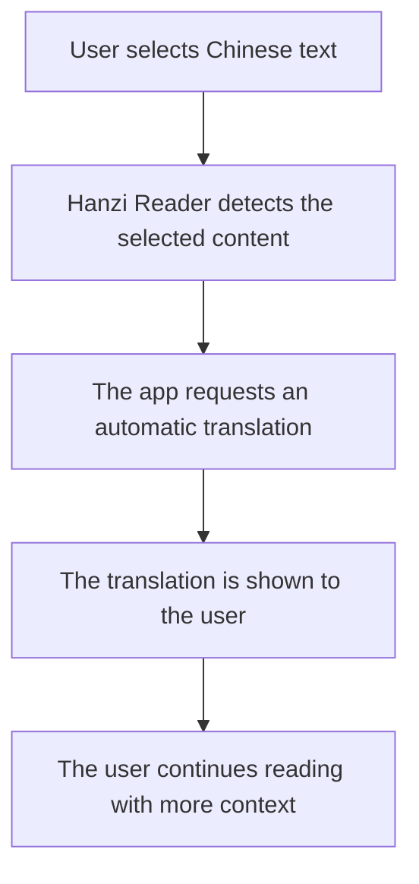
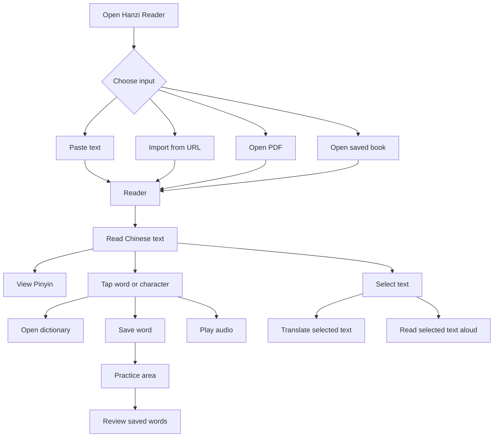
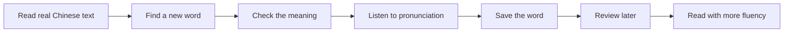
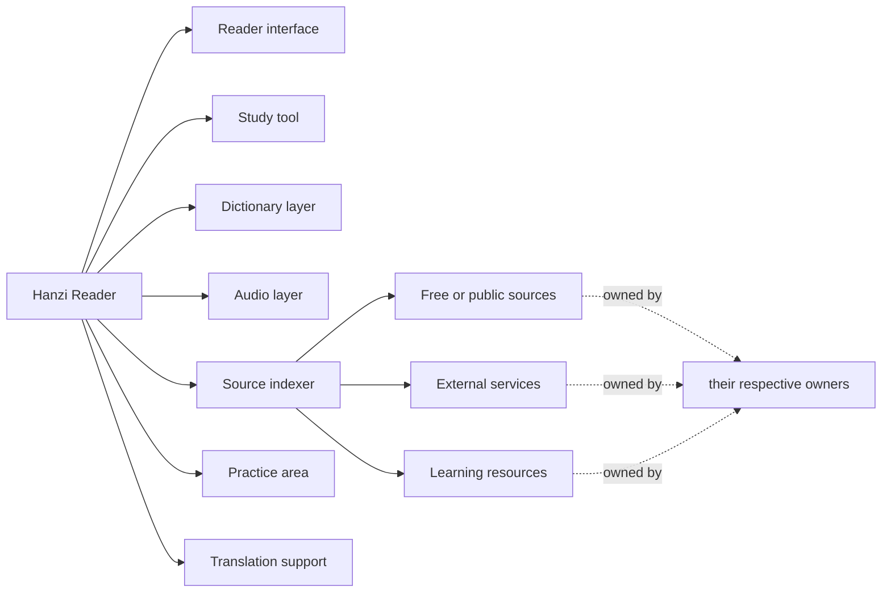
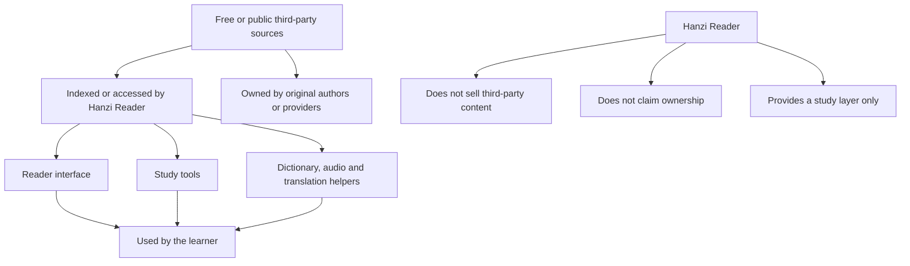
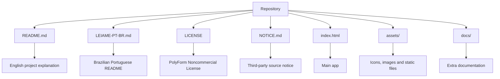

# 漢讀 · Hanzi Reader

> A free, source-available Hanzi reader for studying Chinese through real reading.

[🇧🇷 Ler em Português Brasileiro](./LEIAME-PT-BR.md)

---

## About

**漢讀 · Hanzi Reader** is a Chinese reading tool made for learners who want to read Mandarin texts, books, stories and study materials with useful learning support — without needing to pay a monthly subscription for basic reading features.

This project was created because I believe simple tools for reading your own books, adding Pinyin, checking words, listening to pronunciation, translating selected text and studying Chinese should be accessible.

---

## Project status

```text
Project type: Source-available
Main purpose: Chinese reading and study
Commercial resale: Not allowed
License: PolyForm Noncommercial License 1.0.0
Author: Sr. Hell
```

---

## Why I made this

I was frustrated with apps that lock very basic reading features behind subscriptions.

Paying monthly just to read my own books, see Pinyin, check words, listen to pronunciation or translate a simple text did not feel right to me.

So I started building my own reader — simple, direct and focused on helping Chinese learners.

**Hanzi Reader** is my attempt to create a practical, free and accessible tool for studying Chinese through real reading.

---

## What Hanzi Reader does

```mermaid
flowchart TD
    A["漢讀 · Hanzi Reader"]

    A --> B["Reading"]
    B --> B1["Chinese texts"]
    B --> B2["Books"]
    B --> B3["Long chapters"]
    B --> B4["Clean reading interface"]
    B --> B5["Pinyin support"]

    A --> C["Dictionary"]
    C --> C1["Word lookup"]
    C --> C2["Character lookup"]
    C --> C3["Definitions"]
    C --> C4["Related words"]
    C --> C5["Example sentences"]

    A --> D["Audio"]
    D --> D1["Read aloud"]
    D --> D2["Chinese voices"]
    D --> D3["Browser voices"]
    D --> D4["Experimental emotional voice"]

    A --> E["Study"]
    E --> E1["Saved words"]
    E --> E2["Practice area"]
    E --> E3["Flashcards"]
    E --> E4["Review"]

    A --> F["Import"]
    F --> F1["Manual text"]
    F --> F2["URL import"]
    F --> F3["PDF support"]
    F --> F4["External reading sources"]

    A --> G["Language and translation"]
    G --> G1["English interface"]
    G --> G2["Brazilian Portuguese interface"]
    G --> G3["Browser language detection"]
    G --> G4["Automatic translation support"]
```



---

## Main features

- Read Chinese texts with Pinyin support
- Import manual text
- Import text from URLs
- Read PDF files
- Local library for texts, books and chapters
- Clean interface for long reading sessions
- Save words while reading
- Built-in dictionary
- Word and character lookup
- Definitions, examples and related words
- Automatic translation support
- Translate selected text
- Text-to-speech / read aloud support
- Chinese voice support
- Browser voice support
- Experimental emotional voice modes
- Practice area for saved content
- Flashcards
- English and Brazilian Portuguese interface
- Automatic language selection based on the browser language
- Local browser storage for user data

---

## Translation support

Hanzi Reader includes translation support for words, definitions and selected text.

The goal is to help learners understand Chinese content while reading, especially when they still need support in their native language.



Automatic translation is only a study aid. It may contain mistakes, limitations or context differences.

---

## App flow



---

## Study workflow



---

## Project philosophy

This project is meant to stay simple, useful and accessible.

You can use it, study it, modify it and share it for personal, educational and non-commercial purposes.

Please do not take this project and resell it as a paid clone.

The goal is to help learners, not to create another paywall.

---

## What this project is



---

## What this project is not

Hanzi Reader is **not** a paid clone.

Hanzi Reader is **not** a commercial product.

Hanzi Reader does **not** claim ownership over third-party sources, voices, APIs, datasets, websites, libraries or learning materials.

Hanzi Reader only provides a reader, interface, study layer, translation layer, indexing layer and integration layer for educational purposes.

---

## Third-party sources and content

This project may index, connect to, reference or integrate free, public or browser-accessible third-party resources, including:

- Browser voices
- Microsoft Edge voices
- Translation services
- Chinese learning sources
- Pinyin tools
- Dictionary data
- Stroke order resources
- PDF reading tools
- Public or free reading sources

I do not claim ownership over third-party sources, services, voices, datasets, APIs, websites, libraries or external content used, referenced, indexed or integrated by the app.

All third-party resources remain the property of their respective owners and are subject to their own licenses, terms of use, usage limits, availability and restrictions.

---

## Source relationship



---

## Recommended repository structure

```text
hanzi-reader/
├── README.md
├── LEIAME-PT-BR.md
├── LICENSE
├── NOTICE.md
├── index.html
├── assets/
└── docs/
```



---

## License

This project is released under the **PolyForm Noncommercial License 1.0.0**.

You may use, study, modify and share this project for:

- Personal use
- Educational use
- Research
- Learning
- Non-commercial modification
- Non-commercial redistribution with attribution

You may **not**:

- Sell this project
- Resell modified versions
- Resell unmodified versions
- Include it in paid products
- Offer it as a paid hosted service
- Put it behind a subscription
- Use it commercially without explicit written permission from the author

This project is **source-available**, but it is **not licensed for commercial resale**.

See [`LICENSE`](./LICENSE) and [`NOTICE.md`](./NOTICE.md) for more details.

---

## Notice

Please also read [`NOTICE.md`](./NOTICE.md).

That file explains that Hanzi Reader may index, connect to or integrate free, public or third-party resources, but does not claim ownership over them.

Third-party sources remain owned by their respective owners.

---

## Limitations

This is a personal learning project and may contain bugs, limitations or experimental features.

Some features depend on the browser, internet connection or third-party service availability.

If something stops working, it may be caused by external service changes, CORS restrictions, API changes, browser limitations or temporary unavailability of external sources.

---

## Contributing

Suggestions, improvements and bug reports are welcome.

If you find a problem, have an idea or want to improve the project, feel free to open an issue or contact me.

Please keep the project non-commercial and accessible.

---

## Author

Made by **Sr. Hell**.

Free for personal, educational and non-commercial use.

Please do not sell this project.
