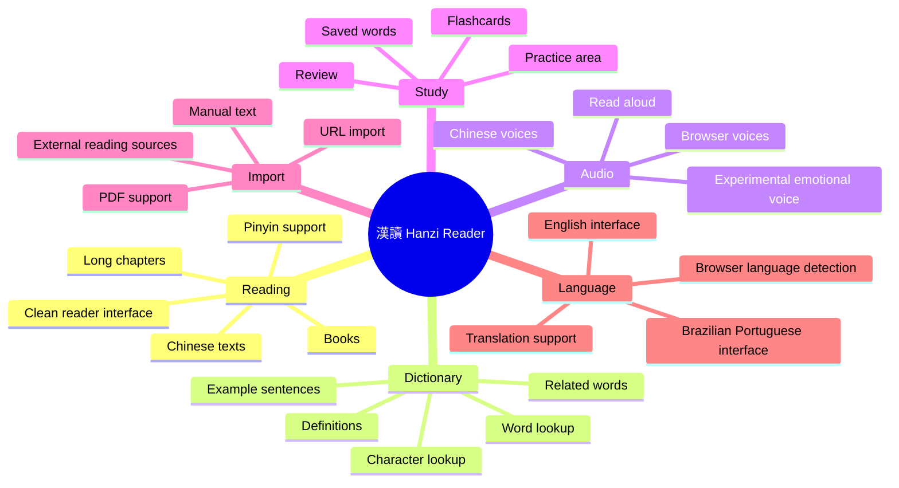
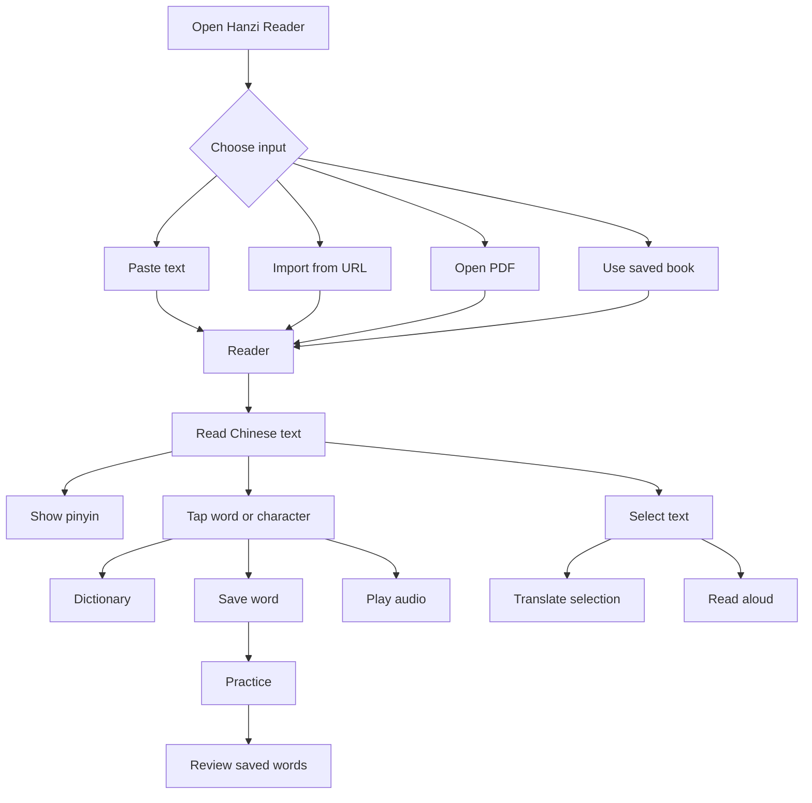
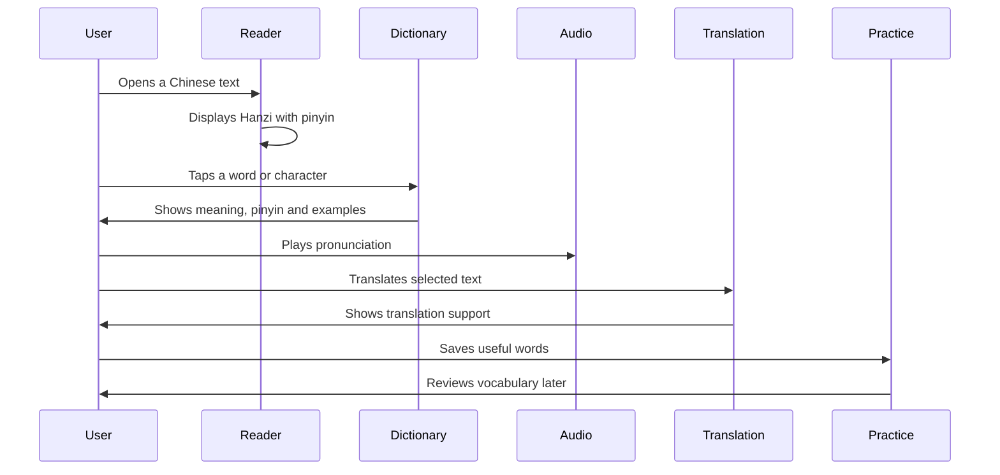
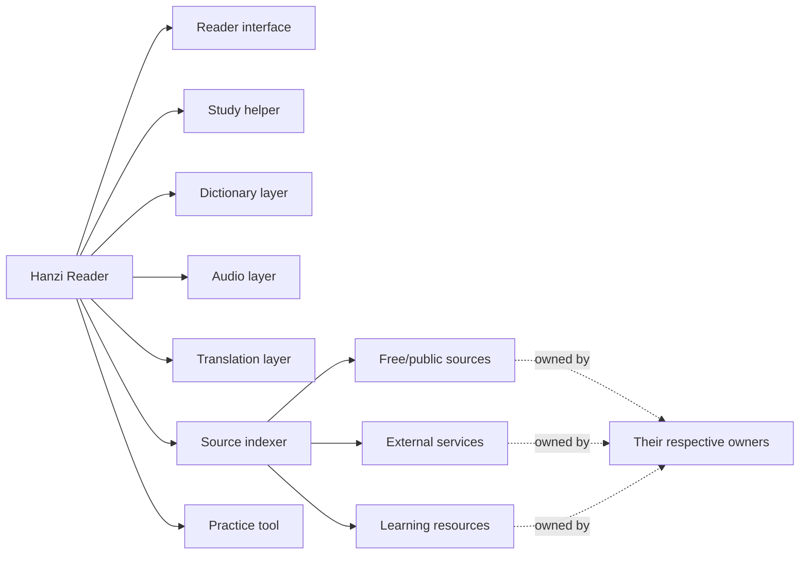
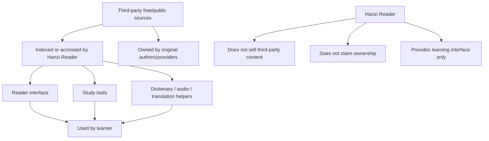
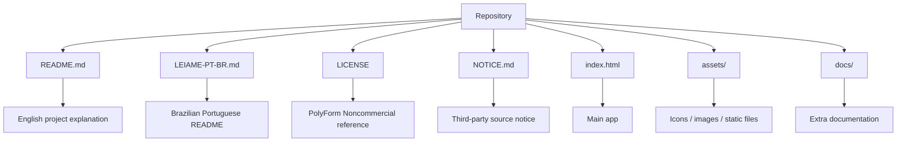

# 漢讀 · Hanzi Reader

> A free, source-available Hanzi reader for studying Chinese through real reading.

[🇧🇷 Ler em Português Brasileiro](./LEIAME-PT-BR.md)

**漢讀 · Hanzi Reader** is a Chinese reading tool made for people who want to read Mandarin texts, books, stories and study materials with useful learning support — without needing to pay a monthly subscription for basic reading features.

This project was created because I believe simple tools for reading your own books, adding pinyin, checking words, listening to pronunciation and studying Chinese should be accessible.

---

## Status

```text
Project type: Source-available
Main purpose: Chinese reading and study
Commercial resale: Not allowed
License: PolyForm Noncommercial License 1.0.0
Author: Sr. Hell
```

---

## Why I made this

I was frustrated with apps that lock very basic reading features behind subscriptions.

Paying monthly just to read my own books, see pinyin, check words or listen to simple pronunciation did not feel right to me.

So I started building my own reader — simple, direct and focused on helping Chinese learners.

Hanzi Reader is my attempt to create a practical, free and accessible tool for studying Chinese through real reading.

---

## What Hanzi Reader does



---

## Main features

- Read Chinese texts with pinyin support
- Import text manually or from URLs
- Read books, chapters and long texts in a clean reader interface
- Save words while reading
- Built-in dictionary view
- Word definitions and automatic translation support
- Text-to-speech / read aloud support
- Chinese voice options
- Experimental emotional voice modes
- Practice area for reviewing saved content
- Brazilian Portuguese and English interface support
- Automatic interface language based on the browser language
- Local storage for user data inside the browser
- PDF reading support
- External source indexing / integration for learning purposes

---

## App flow



---

## Study workflow



---

## Project philosophy

This project is meant to stay simple, useful and accessible.

You can use it, study it, modify it and improve it for personal, educational and non-commercial purposes.

Please do not take this project and resell it as a paid clone.

The goal is to help learners, not to create another paywall.

---

## What this project is



---

## What this project is not

Hanzi Reader is **not** a paid clone.

Hanzi Reader is **not** a commercial product.

Hanzi Reader is **not** claiming ownership over third-party sources, voices, APIs, datasets, websites or learning materials.

Hanzi Reader only provides a reader, interface, study layer, translation layer, index and integration layer for learning purposes.

---

## Sources and third-party content

This project may index, connect to, reference, or integrate free/public third-party resources and browser-accessible services, including:

- Browser / Microsoft Edge text-to-speech voices
- Translation services
- Chinese learning sources
- Pinyin tools
- Dictionary data
- Stroke order resources
- PDF reading tools
- Public or free reading sources

I do not claim ownership over third-party sources, services, voices, datasets, APIs, websites, libraries or external content used, referenced, indexed or integrated by the app.

All third-party resources remain the property of their respective owners and are subject to their own licenses, terms of use, usage limits, availability and restrictions.

---

## Source relationship



---

## Repository structure



Recommended structure:

```text
hanzi-reader/
├── README.md
├── LEIAME-PT-BR.md
├── LICENSE
├── NOTICE.md
├── index.html
├── assets/
└── docs/
```

---

## License

This project is released under the **PolyForm Noncommercial License 1.0.0**.

You may use, study, modify and share this project for:

- Personal use
- Educational use
- Research
- Learning
- Non-commercial modification
- Non-commercial redistribution with attribution

You may **not**:

- Sell this project
- Resell modified versions
- Resell unmodified versions
- Include it in paid products
- Offer it as a paid hosted service
- Put it behind a subscription
- Use it commercially without explicit written permission from the author

This project is **source-available**, but it is **not licensed for commercial resale**.

See [LICENSE](./LICENSE) and [NOTICE.md](./NOTICE.md) for details.

---

## NOTICE

Please also read the [NOTICE.md](./NOTICE.md) file.

That file explains that Hanzi Reader may index, connect to or integrate free/public third-party resources, but does not claim ownership over them.

Third-party sources remain owned by their respective owners.

---

## Disclaimer

This is a personal learning project and may contain bugs, limitations or experimental features.

Some services used by the app may depend on browser support, network access or third-party availability.

If something stops working, it may be caused by external service changes.

---

## Contributing

Suggestions, improvements and bug reports are welcome.

If you find a problem, have an idea, or want to improve the project, feel free to open an issue or contact me.

Please keep the project non-commercial and accessible.

---

## Author

Made by **Sr. Hell**.

Free for personal, educational and non-commercial use.

Please do not sell this project.
